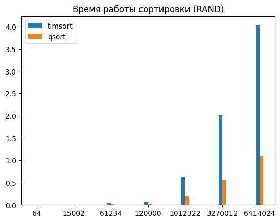
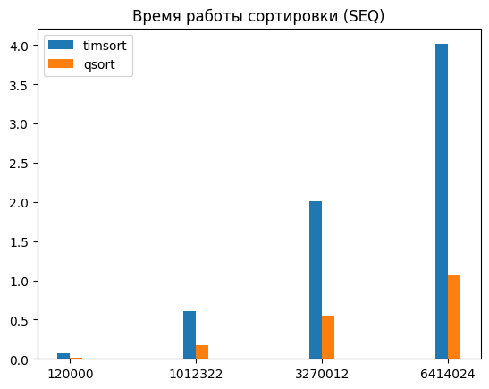

# Отчёт по лабораторной работе 1
## Цель работы
Целью работы было реализовать алогоритм сортировки [Timsort](https://www.baeldung.com/cs/timsort) в составе интерфейса компонента CEcoLab1 и сравнить его производительность с производительностью функции для сортировки `qsort` библиотеки `stdlib`.
## Сравнение производительности
Для сравнения было проведено 11 тестов на массивах размером `[64, 15002, 61234, 120000, 1012322, 3270012, 6414024]`. В первых 7 тестах генерация массивов производилась абсолютно случайным образом, последение 4 с повышенной вероятностью (1/10) генерировали отсортированные подпоследованности размером `[5, array_size * 0.2]`.

Производительность работы функции рассчитывалась как время её выполнения в миллисекундах (мс).
## Результаты сравнения
Хоть алгоритм сортировки Timsort и считается наиболее эффективным среди всех остальных, в данной реализации он показал заметное отставание от библиотечного Qsort.

В обоих случаях (частично отсортированные массивы и абсолютно случайные) timsort пусть не на порядок, но с высокой константой увеличивал время сортировки. Возможно, это связано с тем, что некоторые оптимизации в использованном для реализации варианте алгоритма не были имплементированы. Помимо этого, вероятно влияние высокого использования динамической памяти, что повышает возможность промахов кэша. Как бы то ни было, причин множество, простым замером миллисекунд их не отследить, а на более детальное исследование не хватает ресурсов и возможностей машины для тестирования (на следующем порядке размера массива аллокатор отказывался выделять память).

Графики сравнения приведены ниже.

### Для случайных массивов

### Для массивов с отсортированными подпоследовательностями

# Отчёт по лабораторной работе 2
Компонент CEcoLab1 был дополнен полями для поддержания функционала EcoCalculatorX, EcoCalculatorY,
а также для возможности аггрегирования самого компонента из другого (что происходит в компоненте CEcoLab2).

В ходе работы была выявлена проблема с использованием динамических библиотек: на данный момент для корректной работы необходимо добавлять их в файл с собранным проектом. Решение проблемы найдено не было.

UPD: проблема была решена возможностями CMake.

# Отчет по лабораторной работе 3
В компонент CEcoLab1 добавлены точки подключения для вызова коллбэков в функции `qsort`.